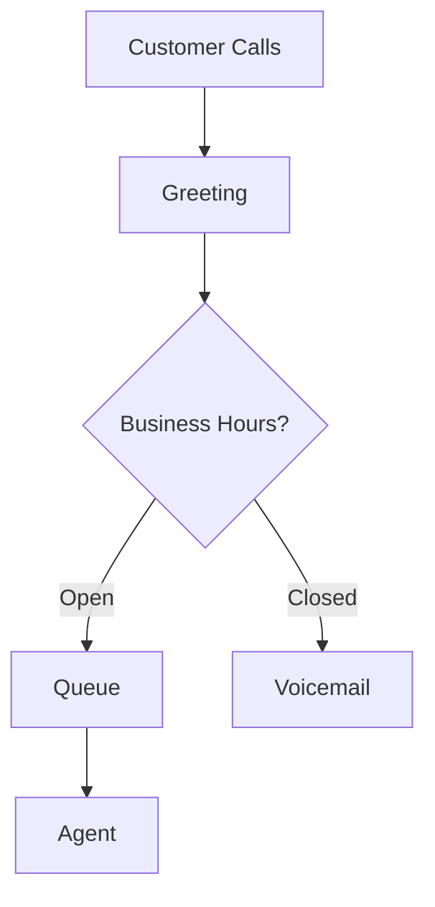

# Create Amazon Connect Contact Flow

Generate a Connect contact flow JSON and related Lambda integrations.

## What You'll Create

1. **Contact Flow JSON** - Connect flow definition
2. **Lambda Functions** - Flow integration handlers
3. **Flow Diagram** - Mermaid diagram of the flow
4. **Configuration Guide** - Setup instructions

## Usage

```
@workspace /create-connect-flow <flow-name> <flow-type>
```

**Flow Types:**

- `inbound` - Inbound call flow
- `routing` - Call routing/transfer flow
- `ivr` - IVR menu flow
- `queue` - Queue management flow
- `callback` - Callback configuration

## Example

```
@workspace /create-connect-flow customer-support inbound
```

## Flow Structure

```json
{
  "Version": "2019-10-30",
  "StartAction": "greeting-001",
  "Actions": [
    {
      "Identifier": "greeting-001",
      "Type": "MessageParticipant",
      "Parameters": {
        "Text": "Thank you for calling. Please hold."
      },
      "Transitions": {
        "NextAction": "check-hours-001"
      }
    },
    {
      "Identifier": "check-hours-001",
      "Type": "InvokeLambdaFunction",
      "Parameters": {
        "LambdaFunctionARN": "arn:aws:lambda:...:function:CheckBusinessHours"
      },
      "Transitions": {
        "NextAction": "route-001",
        "Errors": [
          {
            "ErrorType": "NoMatchingError",
            "NextAction": "error-001"
          }
        ]
      }
    }
  ]
}
```

## Lambda Handler Template

```typescript
import { ConnectContactFlowEvent, ConnectContactFlowResult } from "aws-lambda";

export const handler = async (
  event: ConnectContactFlowEvent,
): Promise<ConnectContactFlowResult> => {
  const {
    Details: { ContactData },
  } = event;

  // Your business logic
  const isBusinessHours = checkHours();

  return {
    statusCode: 200,
    message: isBusinessHours ? "open" : "closed",
  };
};
```

## Flow Diagram



## Best Practices Included

- ✅ Error handling blocks
- ✅ Timeout configurations
- ✅ Customer properties
- ✅ Lambda integration
- ✅ Queue configurations
- ✅ Disconnect flow
